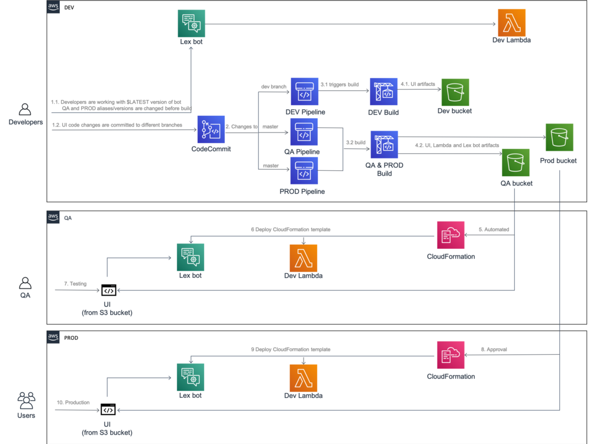

## Cross-account CI/CD pipeline for Amazon Lex bot

Architecture describes how to automate process of exporting Amazon Lex bot from one account and importing it to another using CloudFormation template. Includes build project for source account (to export Lex bot and Lambda function used by bot) and CloudFormation template with custom resource (since Lex is not natively supported by CFN) for another accounts.

## Usage
### Step 1. Create S3 bucket for artifacts in source account
1. Sign in to source account using AWS Management Console and go to **S3**
2.  Select **Create bucket**, give it a name and click **Create**

### Step 2. Create IAM role for CloudFormation in target account
1. Sign in to target account using AWS Management Console and go to **IAM**
2. Select **Policies** and click **Create policy**
3. Switch to **JSON** editor and paste policy from *cfn-deployment-policy.json*
4. Replace **{bucket}** with the name of S3 bucket in source account created on Step 1
5. Click **Review policy**, give it a name and click **Create policy**
6. Select **Roles** and click **Create role**
7. Select **CloudFormation** and click **Next: Permissions**
8. Choose policy created from *cfn-deployment-policy.json* and click **Next: Tags**
9. Add tags (if needed) and click **Next: Review**
10. Give it a name and click **Create role**

### Step 3. Add S3 bucket policy in source account
1. Switch back to source account and go to **S3**
2. Select bucket created on Step 1 and go to **Permissions** tab
3. Select **Bucket Policy** and paste policy from *source-bucket-policy-create.json*
4. Replace **{target-account-id}**, **{cloudformation-role}** and **{bucket}** with target account number (no dashes), role name created on previous step and current bucket name
5. Click **Save**

***Note:*** *Make sure that **Block public access (account settings)** is not blocking cross-account access to buckets*

### Step 4. Deploy CFN template in target account 
1. Switch to target account and go to **CloudFormation**
2. Click **Create stack** (With new resources) and select **Upload a template file** 
3. Select *cfn-template-create.yaml* and click **Next**
4. Specify **Stack name**, **LexBotName**, **LexBotAlias**, **LambdaFunctionName** and click **Next**
5. Select role created on Step 2 under **Permissions** and click **Next** 
6. Accept stack **Capabilities** and click **Create stack**
7. Copy **LexDeploymentRole** from stack **Outputs** and go the next step

### Step 5. Update S3 bucket policy in source account 
1. Switch back to source account and go to **S3**
2. Select bucket created on Step 1 and go to **Permissions** tab
3. Select **Bucket Policy** and paste policy from *source-bucket-policy-update.json*
4. Replace **{target-account-id}**, **{cloudformation-role}**, **{lex-deployment-role}** and **{bucket}** with target account number (no dashes), role name created on Step 2, **LexDeploymentRole** from previous step and current bucket name
5. Click **Save**

### Step 6. Create and run CodeBuild project in source account
1. In source account go to **CodeBuild** and click **Create build project**
2. Create proejct with following details:

 **Project name**: *Any name*  
**Source provider**: *No source*  
**Environment**:  
    **Environment image**: *Amazon Linux 2 (Standard runtime, any image)*  
    **Additional configuration**:  
        **Environment variables**:  
            **LAMBDA_NAME**: *Name of Lambda function used by Lex bot*  
            **LAMBDA_ALIAS**: *Alias of Lambda function to export*  
            **BOT_NAME**: *Name of Lex bot*  
            **BOT_ALIAS**: *Alias of Lex bot to export*  
            **S3_BUCKET**: *Name of S3 bucket created on Step 1*  
**Buildspec**: *Insert build commands* from *buildspec.yml*   
***Note:*** *IAM role used for CodeBuild project has to have permissions to export Lex bot, Lambda function and write objects to source S3 bucket*  
3. Click **Create build project** and run it when it's ready

#### Step 7. Upload custom Lambda function for Lex import to source bucket 
1. Archive *lambda_function.py* from this repo as deployment.zip
2. Go to **S3**, select bucket from Step 1 and click **Upload**
3. Select *deployment.zip* file and click **Upload**

### Step 8. Update CFN stack in terget account
1. Switch back to target account and go to **CloudFormation**
2. Click on stack name from Step 4 and select **Update** 
3. Select **Update current template** and select **Upload a template file**
4. Select *cfn-template-update.yaml* and click **Next**
5. Leave app parameters as is and click **Next**
6. Select role created on Step 2 under **Permissions** and click **Next** 
7. Accept stack **Capabilities** and click **Update stack**

## Security

See [CONTRIBUTING](CONTRIBUTING.md#security-issue-notifications) for more information.

## License

This library is licensed under the MIT-0 License. See the LICENSE file.

